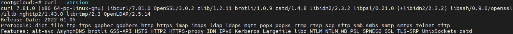
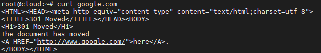
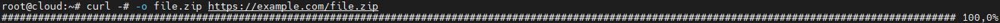
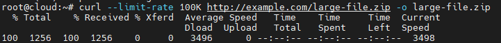

# Lệnh curl 

Nó là chữ viết tắt của “Client URL”, dùng để kiểm tra kết nối tới URL và curl command thường dùng để truyền tải dữ liệu. Curl được cung cấp bởi libcurl, là một bộ thư viện truyền URL phía máy khách. Hãy cùng chúng tôi tìm hiểu cách sử dụng nó

Curl command hỗ trợ các giao thức bên dưới:

- HTTP và HTTPS: cURL hỗ trợ gửi và nhận dữ liệu qua giao thức HTTP và HTTPS.
- FTP và FTPS: cURL có khả năng tải lên và tải xuống tập tin qua giao thức FTP và FTPS (FTP qua SSL/TLS).
- IMAP và IMAPS: cURL có thể truy cập và tương tác với máy chủ email qua giao thức IMAP và IMAPS (IMAP qua SSL/TLS).
- POP3 và POP3S:  cURL hỗ trợ truy cập và tải email từ máy chủ qua giao thức POP3 và POP3S (POP3 qua SSL/TLS).
- SMB và SMBS: cURL hỗ trợ tương tác với máy chủ SMB (Server Message Block) thông qua giao thức SMB và SMBS (SMB qua SSL/TLS).
- SFTP: cURL hỗ trợ truyền tập tập tin qua giao thức SFTP (SSH File Transfer Protocol).
- SCP: cURL có khả năng tải lên và tải xuống tập tin qua giao thức SCP (Secure Copy).
- TELNET: cURL có thể thiết lập kết nối và tương tác với máy chủ qua giao thức Telnet.
- GOPHER: cURL hỗ trợ truy cập vào tài nguyên trên mạng qua giao thức Gopher.
- LDAP và LDAPS: cURL hỗ trợ truy vấn và tìm kiếm dữ liệu qua giao thức LDAP và LDAPS (LDAP qua SSL/TLS).
- SMTP và SMTPS: cURL có khả năng gửi email thông qua giao thức SMTP và SMTPS (SMTP qua SSL/TLS).

Đây là những protocol được hỗ trợ quan trọng nhất, cũng có các giao thức khác ít phổ biến hơn.

## 1. Kiểm tra phiên bản Curl

Đầu tiên, hãy kiểm tra phiên bản Curl bằng lệnh sau để chắc chắn nó đã được cài trên máy

```sh
curl --version
```



Kết quả sẽ hiện phiên bản Curl để bạn biết danh sách protocol được hỗ trợ.

## 2. Cú pháp của lệnh Curl

Lệnh cURL được sử dụng để tương tác với các URL thông qua giao thức khác nhau. Dưới đây là cú pháp cơ bản của lệnh cURL:

```sh
curl [options] [URL]
```

Trong đó:

- `[options]` là các tùy chọn được sử dụng để định cấu hình và điều khiển các thao tác của cURL. Có rất nhiều tùy chọn khác nhau có thể được sử dụng, ví dụ: `-X` để chỉ định phương thức HTTP, `-H` để đặt các tiêu đề yêu cầu, `-d` để gửi dữ liệu POST, `-o` để lưu đầu ra vào một tập tin, vv. Dùng lệnh `curl --help` để xem danh sách đầy đủ các tùy chọn.

- `[URL]` là URL mà bạn muốn tương tác với. Có thể là HTTP, HTTPS, FTP, SFTP, vv. Tùy thuộc vào giao thức, URL có thể bao gồm thông tin như tên miền, cổng, đường dẫn, vv.

Dưới đây là một số ví dụ cơ bản:

1. Gửi yêu cầu GET đến một URL:
```
curl google.com
```



2. Gửi yêu cầu POST với dữ liệu form:
```sh
curl -X POST -d "param1=value1&param2=value2" https://example.com
```

3. Tải xuống một tập tin:
```sh
curl -o filename.ext https://example.com/file.ext
```

4. Gửi yêu cầu với tiêu đề yêu cầu tùy chỉnh:
```sh
curl -H "Content-Type: application/json" https://example.com
```
## 3. Các lựa chọn để dùng Curl command

Curl commands có thể tải file từ một máy chủ từ xa. Bạn có thể thực hiện qua 2 cách::

- -O sẽ lưu file trong cùng thư mục hiện hành với tên file giống với tên file từ xa.
- -o giúp bạn chọn tên file và đường dẫn của file

Ví dụ

```sh
curl -O https://example.com/file.ext
```
Lệnh trên sẽ lưu file là `file.ext`

```sh
curl -o filename.ext https://example.com/file.ext
```

Lệnh trên sẽ lưu file là `filename.ext`

Nếu việc tải file thất bại, bạn cso thể resume bằng lệnh curl

```sh
curl -C - -O https://example.com/file.ext
```

Với curl, bạn có thể tải nhiều file bằng lệnh sau:

```sh
curl -O http://testdomain.com/testfile.tar.gz -O http://mydomain.com/myfile.tar.gz
```

5. Sử dụng tùy chọn **-#** của **curl**: Tùy chọn **-#** cho phép curl hiển thị thanh tiến trình ASCII trong quá trình tải xuống. Ví dụ:

```sh
curl -# -o file.zip https://example.com/file.zip
```


## 4. Curl command cho HTTP

1. Sử dụng Proxy để gửi yêu cầu:
```sh
curl -x proxy_address:port https://example.com
```

Nếu bạn có server đang nghe trên port 8080 tại proxy.example.com, tải file như sau:
```sh
curl -x proxy.example.com:8080 https://example.com
```

Một HTTP request thông thường sẽ luôn chứa header. HTTP header gửi những thông tin công thêm này vào web server từ a bên cạnh yêu cầu thực. Công cụ lập trình trên trình duyệt có thể kiểm tra được thông tin header, nhưng bạn cũng có thể xác thực nó bằng lệnh curl

Bên dưới là ví dụ cách lấy thông tin header từ một website bằng curl:

```sh
curl -I [URL]
```
```sh
root@cloud:~# curl -I https://example.com
HTTP/2 200
accept-ranges: bytes
age: 363236
cache-control: max-age=604800
content-type: text/html; charset=UTF-8
date: Wed, 10 May 2023 08:27:52 GMT
etag: "3147526947"
expires: Wed, 17 May 2023 08:27:52 GMT
last-modified: Thu, 17 Oct 2019 07:18:26 GMT
server: ECS (sab/5797)
x-cache: HIT
content-length: 1256
```

## 5. Curl cho Cookie

Để sử dụng cookies trong `curl`, bạn có thể sử dụng tùy chọn `-b` và `-c` để gửi và nhận cookies từ server.
Dưới đây là một số ví dụ về cách sử dụng cookies trong `curl`:

1. Lưu cookies vào một tập tin và gửi cookies trong yêu cầu tiếp theo:
```sh
curl -c [tên_file_cookie] [url] -O
```
```sh
curl -c cookies.txt https://example.com/login 
curl -b cookies.txt https://example.com/protected-page
```

Trong ví dụ này, `cookies.txt` là tập tin để lưu trữ thông tin cookies. Trong yêu cầu đầu tiên, `curl` sẽ nhận cookies từ server và lưu chúng vào tập tin `cookies.txt`. Trong yêu cầu tiếp theo, `curl` sẽ sử dụng cookies từ `cookies.txt` để gửi yêu cầu tới trang được bảo vệ.

2. Gửi cookies cụ thể trong yêu cầu:

```sh
curl -b "cookie1=value1; cookie2=value2" https://example.com/protected-page
```

Trong ví dụ này, bạn có thể gửi cookies cụ thể trong yêu cầu bằng cách sử dụng tùy chọn `-b` và chỉ định giá trị của cookies như một chuỗi. Đảm bảo rằng bạn tuân thủ đúng định dạng cookies khi chỉ định chúng.

3. Xóa cookies:

```sh
curl -b cookies.txt https://example.com/logout
```

Trong ví dụ này, `curl` sử dụng tùy chọn `-b` để gửi cookies từ tập tin `cookies.txt`. Bạn có thể sử dụng yêu cầu tới một trang đăng xuất để xóa cookies.

## 6. Curl cho FTP

Curl command hỗ trợ FTP! Bạn dùng chúng để tải file từ máy chủ từ xa.

```sh
curl -u username:password -O ftp://sampleftpserver/testfile.tar.gz
```
Trong lệnh ở trên, ftp://sampleftpserver là FTP server chấp nhật kết nối. Username và password có thể bỏ qua nếu như server hỗ trợ anonymous FTP (FTP ẩn danh). Gõ lệnh và xem tiến trình xảy ra

Bạn có thể upload file bằng lệnh sau:

```sh
curl -u username:password -T testfile.tar.gz ftp://sampleftpserver
```

## 7. Giới hạn Output của Curl 

Khi sử dụng curl, bạn không biết được output lớn đến đâu. Để hạn chế sử dụng băng thông lớn, hãy giới hạn curl output lại để tránh bị nghẽn mạng.

Lệnh bên dưới sẽ giới hạn băng thông xuống 100K:

```sh
curl --limit-rate 100K http://testdomain.com/samplefile.tar.gz -O
```



# Tài liệu tham khảo

https://www.hostinger.vn/huong-dan/curl-la-gi-cac-lenh-curl-curl-command-can-biet-trong-linux


