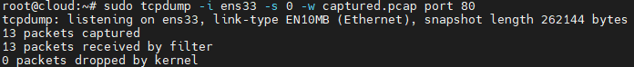
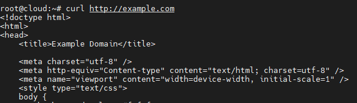
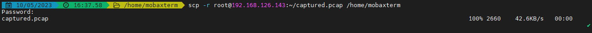
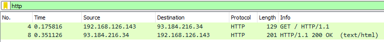
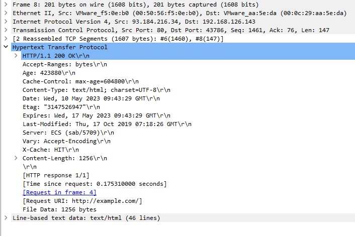

# Bắt và phân tích gói tin

## Kịch bản

1. Sử dụng lệnh `curl` để tương tác với trang web để tạo ra các yêu cầu và phản hồi HTTP
2. Sử dụng lệnh `tcpdump` để bắt gói tin HTTP request và HTTP Respone
3. Phân tích 2 gói tin bắt được

## Thực hiện

Trên Ubuntu:
1. Mở terminal trên Ubuntu.
2. Chạy lệnh sau để bắt gói tin HTTP và lưu vào tập tin `captured.pcap`:
   ```
   sudo tcpdump -i ens33 -s 0 -w captured.pcap port 80
   ```

    

   Lưu ý rằng `ens33` là giao diện mạng của Ubuntu và `port 80` chỉ bắt các gói tin HTTP trên cổng 80. Hãy đảm bảo cổng và giao diện mạng phù hợp với môi trường của bạn.

3. Tiến hành tương tác với trang web hoặc ứng dụng để tạo ra các yêu cầu và phản hồi HTTP.

    

Sau khi đã bắt được gói tin trên Ubuntu, bạn có thể chuyển tập tin `captured.pcap` sang máy chạy Wireshark trên Windows để phân tích gói tin.

Trên máy chạy Wireshark trên Windows:
1. Sao chép tập tin `captured.pcap` từ Ubuntu sang máy chạy Windows.

    

2. Mở Wireshark trên máy chạy Windows.
3. Chọn "File" và sau đó "Open" để mở tập tin `captured.pcap` trong Wireshark.
4. Wireshark sẽ hiển thị danh sách các gói tin đã bắt được. Bạn có thể nhấp đúp vào một gói tin để xem chi tiết về yêu cầu và phản hồi HTTP, tiêu đề (header), dữ liệu, v.v.

    

### Gói tin HTTP Request


- Phương thức yêu cầu (Request Method): GET
- URI yêu cầu (Request URI): /
- Phiên bản giao thức (Request Version): HTTP/1.1
- Header yêu cầu (Request Headers):
    - Host: example.com
    - User-Agent: curl/7.81.0
    - Accept: /
- Full request URI: http://example.com/
- HTTP request 1/1
- Response in frame: 8

Gói tin này là một yêu cầu HTTP GET được gửi từ địa chỉ IP nguồn 192.168.126.143 đến địa chỉ IP đích 93.184.216.34 thông qua cổng nguồn 43786 và cổng đích 80. Yêu cầu này được gửi đến máy chủ example.com, và giao thức HTTP được sử dụng là HTTP/1.1. Yêu cầu cụ thể là truy vấn trang chủ ("/") của máy chủ. Các tiêu đề yêu cầu bao gồm Host, User-Agent và Accept.

### Gói tin HTTP Reponse



- Phiên bản phản hồi (Response Version): HTTP/1.1
- Mã trạng thái (Status Code): 200
- Mô tả mã trạng thái (Status Code Description): OK
- Các tiêu đề phản hồi (Response Headers):
    - Accept-Ranges: bytes
    - Age: 423880
    - Cache-Control: max-age=604800
    - Content-Type: text/html; charset=UTF-8
    - Date: Wed, 10 May 2023 09:43:29 GMT
    - Etag: "3147526947"
    - Expires: Wed, 17 May 2023 09:43:29 GMT
    - Last-Modified: Thu, 17 Oct 2019 07:18:26 GMT
    - Server: ECS (sab/5709)
    - Vary: Accept-Encoding
    - X-Cache: HIT
    - Content-Length: 1256

Thông tin trên cho biết gói tin này là một phản hồi HTTP với mã trạng thái 200 OK từ máy chủ example.com. Giao thức HTTP sử dụng là HTTP/1.1. Phản hồi bao gồm các tiêu đề phản hồi như Accept-Ranges, Age, Cache-Control, Content-Type, Date, Etag