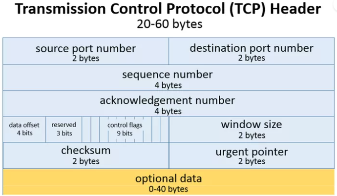
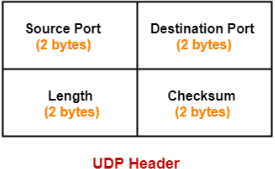

# **Phân biệt TCP và UDP**
Tầng giao vận chịu trách nhiệm chuyển phát toàn bộ bản tin từ ứng dụng tới ứng dụng. Tại tầng này có hai giao thưc chính là TCP và UDP. Mỗi giao thức cung cấp một loại dịch vụ giao vận: Hướng kết nối và phi kết nối. Sau đây ta sẽ phân biệt chi tiết hơn về hai giao thức này.
## **1. Giao thức UDP**
### **Khái niệm**
- UDP (User Datagram Protocol) là giao thức truyền tải hướng không kết nối (nghĩa là có gói tin nào là đẩy ngay vào đường truyền mà không cần thiết lập các kết nối trước)
- Không đảm bảo tính tin cậy khi truyền dữ liệu và không có cơ chế phục hồi dữ liệu (Nó không quan tâm gói tin có đến đích hay không, không quan tâm gói tin có bị mất mát trên đường đi hay không).
- UDP thường được sử dụng trong các ứng dụng cần tốc độ cao như streaming video, game online, VoIP (Voice over Internet), v.v. Trong các ứng dụng này, tính toàn vẹn của dữ liệu không quan trọng bằng tốc độ truyền tải.
- UDP không đỏi hỏi bên gửi hay bên nhận phải liên kết trước khi trao đổi dữ liệu. Vì thế UDP được xem là dịch vụ không hướng nối hay không liên kết trước (connectionless)
### **Ưu điểm** 
- Nhanh (Do không kiểm soát tốc độ gửi, chấp nhận mất mát dữ liệu nhưng đổi lại phải có một tốc độ truyền tối thiểu).
- Hiệu quản hơn đổi với các mục tiêu như kích thước nhỏ và yêu cầu khắt khe về thời gian.
- Ngày nay UDP thường được các ứng dụng đa phương tiện như điện thoại Internet (VoIP), hội thảo từ xa, các ứng dụng thời gian thực sử dụng. Các ứng dụng như thế có thể chấp nhận mất mát, lỗi một phần dữ liệu, vì thế truyền dữ liệu tin cậy TCP không phải là tiêu chí quan trọng nhất để đánh giá sự thành công của một ứng dụng. Hơn nữa các ứng dụng thời gian thực không thích ứng được với cơ chế kiểm soát tắc nghẽn của TCP. Do đó chúng thường lựa chọn UDP ở tầng giao vận.
- Hỗ trợ hình trạng (Topology). UDP hỗ trợ các liên kết 1-1, 1-n, ngược lại TCP chỉ hỗ trợ liên kết 1-1.
- Kích thước Header UDP chỉ có 8 byte cho mỗi đoạn, ngược lại TCP cần các header 20 byte, vì vậy sử dụng băng thông ít hơn.
### **Nhược điểm**
- **UDP thiếu các tín hiệu bắt tay** trước khi gửi một đoạn, UDP không gửi các tín hiệu bắt tay giữa bên gửi và bên nhận, vì thế phía gửi không có cách nào để biết datagram đã đến đích hay chưa. Do vậy, UDP không đảm bảo việc dữ liệu đã đến đích hay chưa.
- **Sử dụng các phiên**. Để TCP là hướng liên kết, các phiên được duy trì giữa các host
- **TCP sửa dụng các chỉ số phiên (session ID)** để duy trì liên kết giữa hai host. UDP không hỗ trợ bất kỳ phiên nào do bản chất phi liên kết của nó
- **Độ tin cậy**. UDP không đảm bảo rằng chỉ có một bản sao dữ liệu tới đích. Để gửi dữ liệu tới các hệ thống cuối, UDP phân chia dữ liệu thành các đoạn nhỏ. UDP không đảm bảo rằng các đoạn này sẽ đến đích đúng thứ tự như chúng đã được tạo ra ở nguồn. Ngược lại, TCP sử dụng các số thứ tự cùng với số hiệu cổng và các gói tin đến đích đúng thứ tự mà nó đã được tạo ra.
- **Kiểm soát luồng**. UDP không có kiểm soát luồng, kết quả là một ứng dụng UDP được thiết kế không tốt có thể làm giảm băng thông của mạng
### **Ứng dụng sử dụng UDP**
- DNS (Domain Name System)-Port 53
- Streaming Media
- VoIP (Voice over IP)
- Game trực tuyến
## **2. TCP (Transmission Control Protocol)**
### **Khái niệm**
- Là giao thức hướng kết nối (Connection-oriented) nghĩa là khi muốn truyền dữ liệu phải thiết lập kết nối trước.
- Hỗ trợ cơ chế full-duplex (Truyền và nhận dữ liệu cùng một lúc)
- Cung cấp cơ chế báo nhận (ACK): Khi A gửi dữ liệu cho B, B nhận được thì gửi gói tin cho A xác nhận là đã nhận. Nếu không nhận được tin xác nhận thì A sẽ gửi cho đến khi B báo nhận thì thôi
- Phục hồi dữ liệu bị mất trên đường truyền ( a gửi B không thấy xác nhận sẽ gửi lại).
- TCP Header: Do là giao thức tin cậy nên Header của TCP rất phức tạp.
- Đối với một số ứng dụng thì TCP không thích hợp. Vấn đề lớn nhất là phía nhận không thể tiếp nhận các gói tin đến sau một gói bị lỗi trước khi chính gói bị lỗi được truyền lại. Điều này khiến TCP không thích hợp cho các ứng dụng thời gian thực (real-time) chẳng hạn như đa phương tiện trực tuyến, trò chơi trực tuyến và thoại trên nền IP bới các ứng dụng này cần các gói tin kịp thời hơn là nhận đủ gói tin theo đúng thứ tự.

**Quá trình bắt tay ba bước**
- Ngược lại với UDP là TCP phải thiết lập quá trình bắt tay ba bước trước khi gửi Data
    - Bước 1: Client gửi tới máy chủ yêu cầu kết nối
    - Bước 2: Server nhận được yêu cầu và gửi trả lại gói tin SYN/ACK để xác nhận kết nối
    - Bước 3: Client gửi dữ liệu hồi âm

**Cấu trúc gói tin**
- TCP header: Chứa thông tin về dữ liệu tưng ứng
- 16 bit cho cổng nguồn và đích

**Địa chỉ cổng**
- 1 số nguyên 16 bit được gán nhãn, định danh ứng dụng (vd: cổng 80 giao thức HTTP)
- Chuyển dữ liệu chính xác đến ứng dụng

**Ưu điểm**
- Truyền dữ liệu đúng trật tự, chính xác
- Không mất dữ liệu, độ tin cậy cao

**Nhược điểm**
- Độ trễ lớn
- Không đáp ứng được nhu cầu về thời gian thực

**Ứng dụng sử dụng TCP**
- SMTP - Port 125
- FTP - Port 21
- HTTP - Port 80

## **So sánh TCP và UDP**
**Định dạng tiêu đề TCP**

- Cả UDP và TCp đều sử dụng các tiêu đề như một phần của dữ liệu tin nhắn đóng gói để truyền qua các kết nối mạng. Mỗi tiêu đề TCp và các tiêu đề UDP chứa một tập tham số được gọi là các trường được xác định bởi các đặc tả kỹ thuật giao thức.

- Mỗi tiêu đề cảu TCP có 10 trường bắt buộc với tổng kích thước 20 byte (160 bit). Chúng cũng có thể tùy chọn bao gồm một phần dữ liệu bổ sung có kích thước lên tới 40 byte
- Các tiêu đề TCP xuất hiệ theo trình tự sau:
    
         Số cổng TCP nguồn - Source port number (2 byte)
         Số cổng TCP đích - Destination port number (2 byte)
         Số thứ tự - Sequence number (4 byte
         Dữ liệu TCP bù - Data offset (4 bit
         Dữ liệu dành riêng - Reverved (3 bit)
         Cờ điều khiển - Control flags (Tối đa 9 bit)
         Kích thước cửa sổ - Window size ( 2 byte)
         Kiểm tra TCP - Checksum (2 byte)
         Con trỏ khẩn cấp - Urgent pointer (2 byte)
         Dữ liệu tùy chọn TCP - Optional data (0-40 byte)
- Các tiêu đề cung cấp thông tin cụ thể:
    - **Source port number và Destination port number** số cổng TCP nguồn và đích là điểm cuối giao tiếp để gửi và nhận thiết bị
    - **Sequence number** Người gửi tin nhắn sử dụng số thứ tự để đánh dấu thứ tự của nhóm tin nhắn (segment). Cả người gửi và người nhận đều sử dụn trường số xác nhận để truyền đạt số thứ tự của ti nhắn được nhận gần đây hoặc dự kiến sẽ được gửi
    - **Ack number** Nếu cờ ACK bật thì giá trị của trường chính là số thứ tự gói tin tiếp theo mà bên nhận cần 
    - **Data offset** trường có độ dài 4 bit quy định độ dài của Header (Tính theo đơn bị 32 bit). Phần Header có độ dài tối thiểu là 5 từ (160 bit) và tối đa 15 từ (480 bit)
    - **Reserved** Dữ liệu dự trữ trong các Header TCP luôn có giá trị bằng 0. Trường này phục vụ mục đích căn chỉnh tổng kích thước tiêu đề (quan trọng đối với hiệu quả xử lý dữ liệu máy tính)
    - **Control flags** TCP sử dụng một bộ sáu cờ điều khiển tiêu chuẩn và ba cờ mở rộng (Mỗi bit riêng lẻ (0 là tắt, 1 là bật) đại diện cho bật hoặc tắt) để quản lý luồng dữ liệu trong các tình huống cụ thể.
    - **Window size** Người gửi TCP sử dụng một số được gọi là kích thước cửa sổ để điều chỉnh lại lượng dữ liệu mà họ gửi đến người nhận trước khi yêu cầu xác nhận lại. Nếu kích thước cửa sổ trở nên quá nhỏ, việc truyền dữ liệu mạng sẽ chậm một cách không cần thiết, trong khi nếu kích thước cửa sổ quá lớn, liên kết mạng có thể bị bão hòa (không thể sử dụng cho bất kỳ ứng dụng nào khác) hoặc người nhận có thể không thể xử lý dữ liệu đến nhanh chóng (cũng dẫn đến hiệu suất chậm). Các thuật toán window được tích hợp trong giao thức sẽ tự động tính toán các giá trị kích thước và sử dụng trường tiêu đề TCP này để phối hợp các thay đổi giữa người gửi và người nhận.
    - **Checksum** các giá trị bên trong một tiêu đề TCP được tạo ra bởi người gửi giao thức như một kỹ thuật để giúp người nhận phát hiện tin nhắn bị hỏng hoặc giả mạo
    - **Urgent point** Trường con trỏ khẩn cấp thường được đặt thành 0 và bị bỏ qua, nhưng kết hợp với một trong các cờ điều khiển, nó có thể được sử dụng làm phần bù dữ liệu để đánh dáu một tập hợp con của thông điệp cần xử lý ưu tiên
    - **Optional data** Việc sử dụng dữ liệu TCP tùy chọn bao gồm hỗ trợ cho cá thuật toán xác nhận và mở rộng. Trường này cũng không thuộc về Header. Giá trị của trường này là thông tin fanhf cho cá tầng trên (trong mô hình OSI)

**Định dạng tiêu đề UDP**

- Vì UDP bị hạn chế đáng kể về khả năng so với TCP, nên các tiêu đề của nó nhỏ hơn nhiều. Một header UDP chứa 8 byte, được chia thành bốn trường bắt buộc sau:

        Số cổng nguồn - source port (2 byte)
        Số cổng đích - Destination port (2 byte)
        Độ dài của dữ liệu - Length (2 byte)
        Kiểm tra UDP - Checksum (2 byte)
    - **Source**. Trường này xác định cổng của người gửi thông tin vsf có ý nghĩa nếu muốn nhận thông tin phản đối từ người nhận. Nếu không dùng đến thì đặt nó bằng 0
    - **Destination Port** Số cổng UDP nguồn và đích là điểm cuối giao tiếp để gửi và nhận thiết bị (như TCP)
    - **Length** Trường này có độ dài 16 bit xác định chiều dài của toàn bộ Datagram: phần Header và phần dữ liệu. Chiều dài tối thiểu là 8 byte khi gói tin không có dữ liệu chỉ có header
    - **Checksum** Tương tự như TCP, tổng kiểm tra UDP cho phép người nhận kiểm tra chéo dữ liệu đến cho bất kỳ bit bị hỏng nào của tin nhắn

**Tóm  lại UDP và TCP heaader khác nhau khá nhiều như:**
- Số thứ tự - Sequence number (4 byte)
    - TCP có đánh số thứ tự các segment còn UDP không có. Đó là nguyên do khiến dữ liệu không được gửi đến máy chủ một cách tuần tự.
- Số xác nhận - ACK (4 byte)
    - Server sẽ gửi 1 bản tin ACK phản hồi lại sau khi Client gửi yêu cầu kết nối dến. Đây cũng là quá trình bắt tay 3 bước trước khi gửi dữ liệu
    - UDP thì không có tính xác nhận này, client cứ gửi gói tin đến mà không báo trước cho server là sẽ gửi, gửi một cách bừa bãi
- Dữ liệu bù - Data Offset (4 bit)
    - Khi dữ liệu chưa được gửi 1 đến đầy đủ hoặc bị lỗi tại 1 segment nào đó thì TCP sẽ bù bằng cách lấy dữ liệu dành riêng để gửi lại cho segment ấy
    - UDP không có cái này
- Dữ liệu dành riêng - resered (3 bit)
    - TCP có
    - UDP không có
- Cờ điều khiển - control flags (Tối đa 9 bit)
    - TCP sẽ sử dụng các cờ này để làm quá trình bắt tay ba bước trước khi gửi data
    - UDP không có cờ này
- Kích thước cửa sổ - window size (2 byte)
    - Người gửi TCP sử dụng cái này để điều chỉnh dữ liệu họ gửi đến ngời nhận trước khi yêu cầu xác nhận lại
    - Các thuật toán nào trong window size này được tích hợp trong giao thức, sẽ tự động tính toán các giá trị, kích thước dữ liệu để phối hợp các thay đổi giữa người gửi va người nhận
    - UDP không có
- Con trỏ khẩn cấp -Urgent pointer (2 byte)
    - TCP có
    - UDP không có
- Dữ liệu tùy chọn TCP - Optional Data (0-40 byte)
    - TCP có
    - UDP có thể có hoặc không

# **Tài liệu tham khảo**
1. Giáo trình cơ sở mạng truyền thông - PTIT
2. https://viblo.asia/p/tim-hieu-giao-thuc-tcp-va-udp-jvEla11xlkw
3. https://quantrimang.com/cong-nghe/su-khac-nhau-giua-giao-thuc-tcp-va-udp-154559

