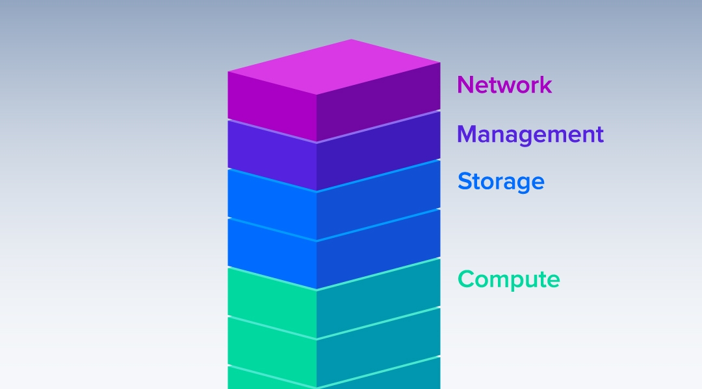
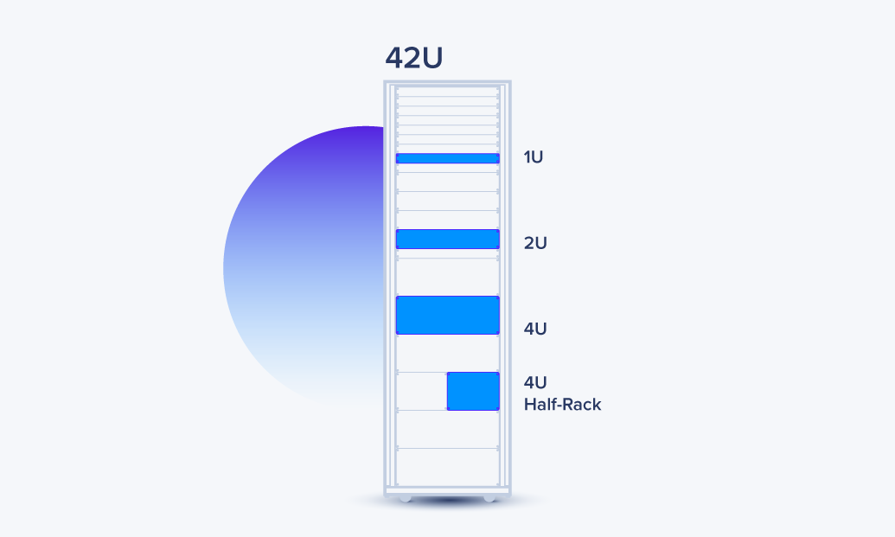
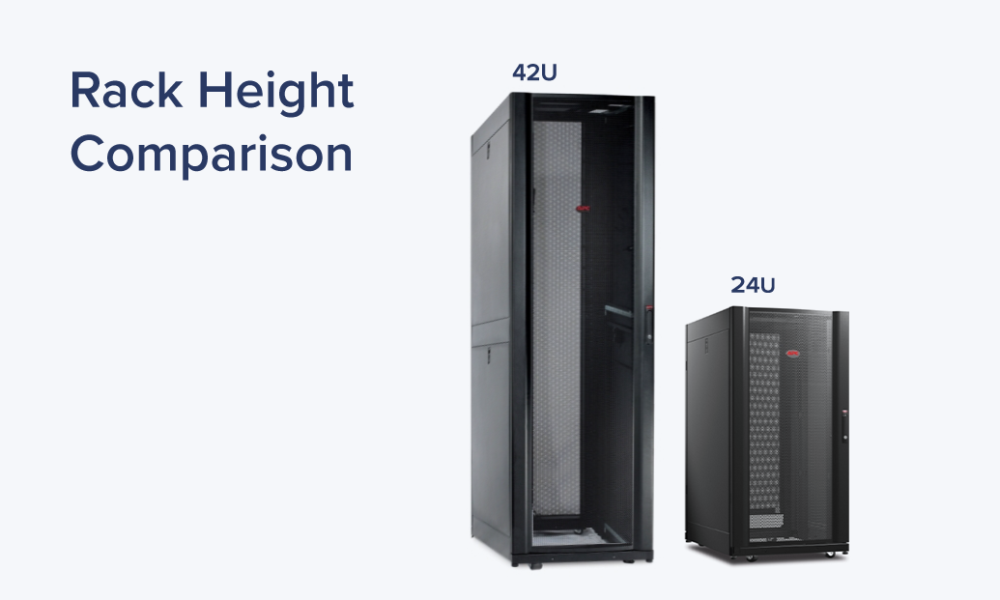
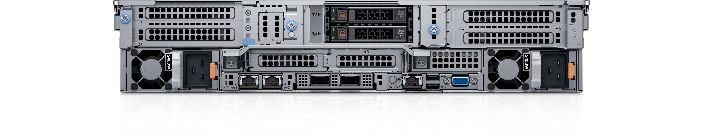
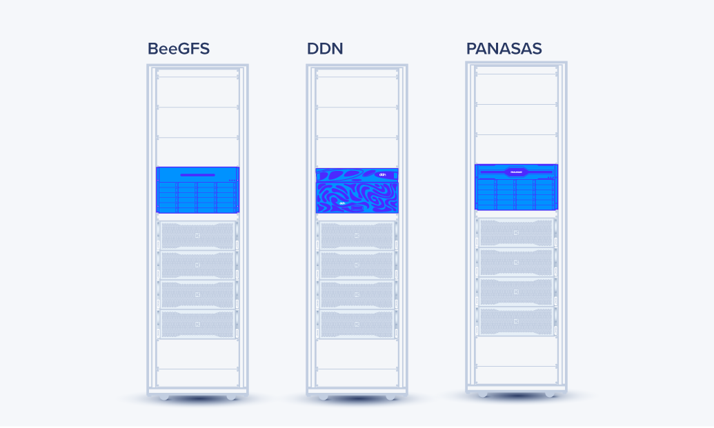
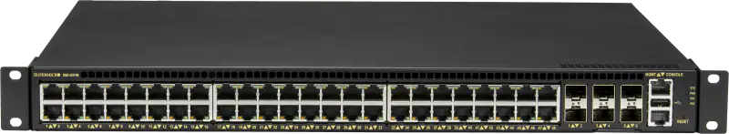
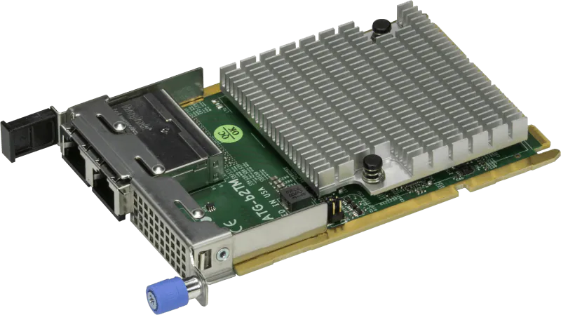

# **Giới thiệu**

Máy chủ (Server) là một thiết bị máy tính có chức năng chính là cung cấp dịch vụ, lưu trữ và quản lý tài nguyên cho các thiết bị khác kết nối đến mạng hoặc Internet. Máy chủ được trang bị các thành phần phần cứng và phần mềm cần thiết để hoạt động như một trung tâm điều khiển của mạng, xử lý yêu cầu và trả lại kết quả cho các thiết bị khác.

Cụm máy chủ (Server cluster) là một tập hợp các máy chủ độc lập nhau, được kết nối với nhau và hoạt động như một đơn vị đồng bộ để cung cấp tài nguyên máy tính vượt trội. Cụm máy chủ cho phép chia sẻ tài nguyên và phân phối công việc giữa các máy chủ thành viên để tăng hiệu suất và khả năng mở rộng.

Cụm máy chủ thường được sử dụng cho các ứng dụng có yêu cầu cao về xử lý, đặc biệt là các ứng dụng web hoặc dịch vụ đám mây. Khi số lượng người dùng tăng lên hoặc khi yêu cầu tài nguyên của hệ thống tăng cao, các máy chủ trong cụm sẽ được kích hoạt để tăng hiệu suất và đáp ứng nhu cầu của người dùng

Chúng ta có thể chia nhỏ cụm thành năm thành phần:
- Tủ Rack
- Management Node (Node quản lý)
- Compute Node (Node xử lý)
- Storage Node (Node lưu trữ)
- Network Switch (Các bộ chuyển mạch)

<h3 align="center"></h3>

1. **Rack**

Rack là thùng chứa / thùng máy / tủ bên ngoài chứa các náy chủ dạng rackmount (giá đỡ), thiết bị chuyển mạch, PDU, hệ thống caple được tổ chức bên tron. Rack có thể có kích thước bằng một nửa như 24U, đến 48U (chữ "U" hoặc thường được gọi là "RU" là đơn vị đo lường để xác định chiều cao của máy chủ)

<h3 align="center"></h3>

NTC thường khuyến nghị một tủ rack 42U, vì phần diện tích chiếm dụng cũng giống như một nửa rack và cho phép mở rộng quy mô cho các hệ thống bổ sung trong tương lai sẽ thêm vào cụm

<h3 align="center"></h3>

2. **Management Node (node quản lý)**

Management Node (Node quản lý) là một thành phần quan trọng trong một cụm máy chủ (cluster), chịu trách nhiệm quản lý, điều khiển và giám sát hoạt động của toàn bộ cụm máy chủ. Node quản lý thường được cấu hình với phần mềm quản lý cụm máy chủ và các công cụ quản lý hệ thống để có thể điều khiển và quản lý các máy chủ trong cụm.

Node quản lý được sử dụng để cấu hình, triển khai và cài đặt các ứng dụng và dịch vụ cho toàn bộ cụm máy chủ. Nó cũng giám sát hoạt động của các máy chủ trong cụm và cung cấp các thông tin về tình trạng và hiệu suất của chúng.

Một số tính năng chính của Node quản lý bao gồm:

- Quản lý tài nguyên: node quản lý có thể quản lý tài nguyên của toàn bộ cụm máy chủ, bao gồm CPU, bộ nhớ, ổ cứng và mạng.
- Quản lý dịch vụ: node quản lý có thể cài đặt, cấu hình và quản lý các dịch vụ trên các máy chủ trong cụm, bao gồm các dịch vụ web, cơ sở dữ liệu, ứng dụng và các dịch vụ khác.
- Quản lý bảo mật: node quản lý có thể quản lý bảo mật của toàn bộ cụm máy chủ, bao gồm việc cài đặt các chứng chỉ SSL, xác thực và phân quyền truy cập.
- Quản lý mạng: node quản lý có thể quản lý các thiết bị mạng và cấu hình mạng cho toàn bộ cụm máy chủ.
- Giám sát và báo cáo: node quản lý có thể giám sát và báo cáo hiệu suất, tình trạng và các sự cố của các máy chủ trong cụm để đảm bảo hoạt động ổn định và tin cậy.

3. **Các compute node (node xử lý, node điện toán)**

Compute node (nút tính toán) là thành phần chính trong một cụm máy chủ. Chúng là các máy chủ tính toán chuyên dụng được thiết kế để xử lý các tác vụ tính toán phức tạp và tốn nhiều tài nguyên. Các compute node thường được kết nối với nhau và với node quản lý thông qua mạng.

Mỗi compute node thường được trang bị với các thành phần phần cứng cơ bản bao gồm CPU, bộ nhớ RAM, ổ đĩa cứng và các thành phần mạng để kết nối với mạng lưới. Những máy chủ tính toán này thường có cấu hình cao với khả năng xử lý đa luồng, bộ nhớ lớn và tốc độ cao để có thể thực hiện các tác vụ tính toán phức tạp.

Trong một cụm máy chủ, có thể có hàng trăm hoặc thậm chí hàng nghìn compute node được kết nối với nhau để tạo ra một hệ thống tính toán mạnh mẽ và hiệu quả. Các compute node này hoạt động đồng bộ với nhau để phân chia công việc và xử lý các tác vụ tính toán phức tạp

<h3 align="center"></h3>

Một số tính năng thông thường của một compute node bao gồm:

- CPU: Một hoặc nhiều bộ xử lý đa nhân để thực hiện các tác vụ tính toán.
- Bộ nhớ RAM: Để lưu trữ dữ liệu tạm thời và cung cấp cho CPU để thực hiện các tính toán.
- Ổ đĩa: Để lưu trữ dữ liệu dài hạn.
- Kết nối mạng: Để kết nối với các node khác trong cụm máy chủ.
- Hệ điều hành: Để quản lý tài nguyên và cung cấp môi trường thực thi cho các ứng dụng và tác vụ tính toán.

Ngoài ra, các compute node còn có thể có các tính năng như card mạng, card đồ họa, các cổng kết nối, các module quản lý hệ thống, các tản nhiệt, các cổng USB và các linh kiện điện tử khác để đáp ứng các yêu cầu tính toán cụ thể

4. **Storage Node (Các node lưu trữ)**

Như tên của nó, thành phần lưu trữ là một “ao”(pool) lưu trữ được chia sẻ chung có thể chứa dữ liệu kết quả, hình ảnh, mã code hoặc bất kỳ thứ gì khác đặc thù cho một nhóm nghiên cứu. Lưu trữ có thể là các rack NAS (Networked Attached Storage) đơn giản hoặc các hệ thống lưu trữ song song tốc độ cao, phức tạp hơn như các giải pháp DDN, Panasas,…

<h3 align="center"></h3>

Mỗi thành phần này có thể được giải thích và mổ xẻ sâu hơn trong bối cảnh riêng của chúng. Thông thường, NTC đề xuất một kho lưu trữ / gắn kết được chia sẻ duy nhất có thể được kết hợp trong node quản lý và thường là cách triển khai đơn giản nhất để đảm bảo không gian lưu trữ được chia sẻ ở trung tâm.

5. **Switch**

<h3 align="center"></h3>

Switch (còn được gọi là bộ chuyển mạch) là một thiết bị mạng được sử dụng để kết nối nhiều thiết bị mạng khác nhau như máy tính, máy chủ, thiết bị lưu trữ, máy in, điện thoại IP, camera IP và các thiết bị khác trong một mạng LAN (Local Area Network) hoặc mạng WAN (Wide Area Network). Switch hoạt động bằng cách truyền tải dữ liệu từ thiết bị nguồn đến thiết bị đích một cách hiệu quả hơn so với việc dùng hub hoặc repeater. Switch có thể được quản lý hoặc không quản lý và có thể cấu hình để cung cấp các tính năng bảo mật, quản lý băng thông, chia VLAN (Virtual Local Area Network), hỗ trợ QoS (Quality of Service), và nhiều tính năng khác tùy thuộc vào từng loại switch và nhu cầu sử dụng

6. **Network Controller**
<h3 align="center"></h3>

Network Controller (còn gọi là Network Interface Card hoặc NIC) là một phần cứng mạng được cài đặt trên máy tính, máy chủ, hoặc các thiết bị mạng khác để kết nối với mạng LAN hoặc WAN. Network controller có nhiệm vụ điều khiển các kết nối mạng của thiết bị, nhận và gửi dữ liệu trên mạng, và giúp kiểm soát tốc độ truyền dữ liệu. Các loại NIC phổ biến bao gồm Ethernet, Wi-Fi, Bluetooth, 3G/4G, và các chuẩn mạng khác.

Một số network controller có tính năng quản lý băng thông để giúp ưu tiên truyền dữ liệu của ứng dụng quan trọng và giảm thiểu sự cạnh tranh về tốc độ mạng giữa các ứng dụng khác nhau. Một số NIC cũng hỗ trợ các tính năng bảo mật, chẳng hạn như mã hóa dữ liệu và chứng thực mạng để giúp bảo vệ thông tin truyền qua mạng

# **Quy trình thực hiện các bước để vào IDC Nam Thăng Long**

- Ban đầu, muốn vào IDC thì ta phải khai báo thông tin cá nhân như mail, số điện thoại, căn cước công dân để được đăng ký vào IDC
- Sau đó khi đến cổng vào IDC, ta sẽ phải đăng ký thông tin như họ tên, ID(Đối với người là nhân viên VNPT-IDC) / cccd cho nhân viên bảo vệ (Đối với người không phải nhân viên VNPT-IDC)(Lớp 1)
- Tiếp đến di chuyển vào quầy lễ tân, chúng ta tiếp tục đăng ký thông tin như họ tên, cccd, thời gian check in, cho lễ tân. (Lớp 2)
- Để vào được bên trong khu vực văn phòng, trung tâm dữ liệu, thì cần phải liên hệ với nhân viên làm việc tại IDC để mở một lớp cửa khóa tự động và được phát cho thẻ Khách, giữ lại cccd
- Sau khi làm việc xong, sẽ thông báo cho nhân viên IDC để cấp lại cccd, di chuyển ra quầy lễ tân báo cho nhân viên thời gian Check out, tương tự khi qua cổng bảo vệ ở ngoài

